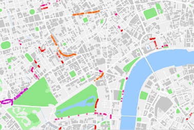
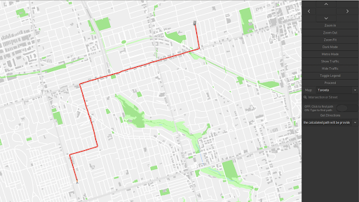
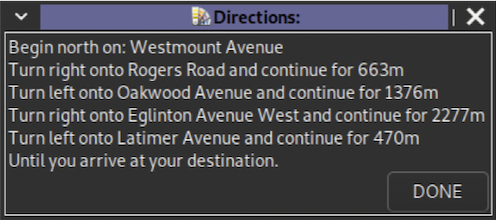
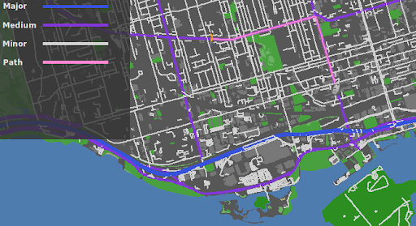

# C++ Mapping Software for ECE297

This is a geographical mapping software that visualizes cities across the globe. Designed for commuters in densly populated cities who travel by car, bus and train. Written using C++, and visualizes data from the OpenStreetMap database API through graphics libraries like GTK and EZGL.
| Toronto, Canada | London, England |
|:-----------------:|:-----------------:|
| |  |
 

## Main Features
* Uses mouse or buttons to zoom, scroll and pan around the city
* Utilizes a Dropdown menu to select between cities
* Visualizes different features such as roads, parks and lakes
* Displays street names, subway stations, points of interests, etc...
* Pulls live weather from an API to find the current conditions anywhere on in a city
* Visualizes live traffic from an API to highlight all road closures, construction sites and more
* Finds the optimal route between two intersections for commuters to get from point A to B
* Displays simplistic driving instructions so commuters can travel along the optimal path with guidance
* Can search for specific streets or intersections using search bar with built-in autocomplete
* Can toggle between dark mode and light mode
* Has a visual legend to idenfity between different features and road types

## Pathfinding Algorithm

### Describing the Graph Data Strcucture

Information is retrieved through the OpenStreetMaps API and the OSM database to build a graph which represents a map of a city. Each intersection of the city is represented as a node, and each intersection is connected by 1 or more street segments which represent the edges of the graph. Together these two attributes form the basis of our graph for which we were able to visualize and create a pathfinding algorithm.

### Pathfinding using A* Search Algorithm
Our mapping software utilizes the A* pathfinding algorithm approach. Our Pathfinding algorithm makes use of a variety of data structures - specifically, a heap, which is used to store high-priority intersections at the top. Those that contain the minimum travel time are dequeued, and its neigbouring intersections are enqueued until the destination intersection has been found. Since the algorithm is A*, it utilizes a heuristic which takes into account an intersections geometric (Euclidean) distance from destination. Those that are closer to the destination sit near the top of the heap, making our algorithm much more efficient.

### The Travelling Salesman (NP - Hard Problem)
The Travelling Salesman Problem (TSP) expands upon our A* pathfinding algorithm to find the optimal route for a courier delivering packages. Given a handful of starting locations, and many pickup/dropoff locations, our algorithm was designed to calculate the most optimal path that visits all the required intersections. Since this problem is very complex, our algorithm took an iterative approach, coming up with hundreds of solutions and annealing them until the most optimal route is found within its given time-limit. This approach uses a "hill-climbing" technique to ensure that solutions are not found within local minima, and the entire solution space is explored to come up with the best solution possible within the given timeframe.

## Screenshots
| Traffic View | Pathfinding Visual |
|:-----------------:|:-----------------:|
|   |  |

| Pathfinding Visual | Directions |
|:-----------------:|:-----------------:|
|   |  |

| Light Mode | Dark Mode |
|:-----------------:|:-----------------:|
|   |  |

| Street View | Street Legend |
|:-----------------:|:-----------------:|
|   |  |

## Contact

John Boulanger  
Email: john03yyc@gmail.com  
Github: JohnBoulanger  
Linkedin: <a href="https://www.linkedin.com/in/john-boulanger-42a706279/">My Homepage</a> 

